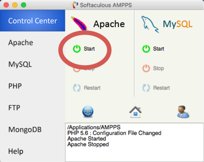

# 壹、安裝空白Laravel 

## 一、安裝Ampps

```
＊Ampps是一個簡單快速地開發環境包，省去自行安裝開發環境
官方網站：http://ampps.com/
```

1. 下載ampps：[_http://files.ampps.com/AMPPS-3.3.dmg_](http://files.ampps.com/AMPPS-3.3.dmg)
2. 點開下載完的dmg檔，點開後如下圖
3. 拖曳左邊的檔案到右邊的Application資料夾裡
4. 

## 二、設定Ampps

1. 到Launchpad 找 Ampps 這隻應用程式
2. 應用程式內容如下圖
3. 進入PHP標籤內
4. 

## 三、設定Ampps - PHP Version

1. 進去Change PHP Version，更改PHP Version 到 PHP 5.6，再按Apply
2. 記得再進去一次Change PHP Version，查看有沒有真的變動
3. 

## 四、設定Ampps - PHP Extension

1. 進去 PHP Extension，將下面圖示有打勾的皆打勾，此為運行laravel必備的套件
2. 全部打完勾記得再按apply
3. 然後一樣記得再進去一次PHP Extension，查看有沒有真的變動
4. 
5. 

## 五、判斷是否安裝過oh-my-zsh

```
※oh-my-zsh是一款優化過後的bash，如果真的要用請參考：[_http://goo.gl/rgN8VT_](http://goo.gl/rgN8VT)
```

1. 到Launchpad 搜尋“終端機”或是你自己安裝的”iTerm”，點開任一個App
2. 視窗最上面如果出現 zsh 等字樣（如下圖），即代表你曾經安裝過另外一款優化原生bash的程式，接著到步驟六之一
3. 視窗最上面如果出現 bash 等字樣，請接著到步驟六之二
4. 

## 六之一、oh-my-zsh設定系統PHP執行位置


1. 執行
    `sudo nano ~/.zshrc （需輸入密碼） `
2. 進去後是編輯文字的畫面，按鍵盤上的”下鍵“到文字最下面，一直按著”下鍵“直到螢幕不會自動刷新為止，看旁邊的scroll bar 是沒有用der
3. 到最下面後，用Command + V 的方式貼上，下面這行code
    `export AMPPS_PHP=/Applications/AMPPS/php/bin`
4. 接步驟七

```
※中途如有要求輸入password，請直接輸入你開機密碼
```

## 六之二、原生bash設定系統PHP執行位置

1. 執行：
    `sudo nano ~/.bash_profile （需輸入密碼）`
2. 進去後是編輯文字的畫面，按鍵盤上的”下鍵“到文字最下面
3. 到最下面後，用Command + V 的方式貼上，下面這行code
    `export AMPPS_PHP=/Applications/AMPPS/php/bin`
4. 接步驟七

## 七、設定完成php執行位置

1. 貼上完code後，按 Ctrl + O 後，視窗下面會出現類似下圖一的內容
2. 再接著按 Enter，就會出現 Wrote * lines，如下圖二
3. 最後再按 Ctrl + X，就可以跳回原輸入指令的地方
4. 
5. 

## 八、打開Apache


1. 打開Ampps 應用程式
2. 對 Apache （需輸入密碼） 點擊 Start

## 九、安裝Composer

1. 重新開啟“終端機”或”iTerm”
2. 輸入下面指令：
    `export PATH="$AMPPS_PHP:$PATH"`
3. 輸入下面指令，測試現在php執行位置：
    `which php`
4. 如果吐出的內容是：
    /Applications/AMPPS/php/bin/php 請繼續執行步驟九 - 6
5. 如果吐出的內容是：
    /usr/bin/php 
     請輸入下面指令：
    `export AMPPS_PHP=/Applications/AMPPS/php/bin
    `再重步驟九 - 2 開始
6. 接著輸入下面指令：
    `sudo curl -sS https://getcomposer.org/installer | php`
7. 如果安裝成功，應會看到 Composer successfully installed 等字樣
8. 上面指令跑完後 再接著輸入：
    `sudo mv composer.phar /usr/local/bin/composer`

## 十、安裝Laravel

1. 繼續執行“終端機”或”iTerm”任一個App
2. 執行：
    `cd /Applications/Ampps/www`
3. 再執行下列指令，開始創建Laravel的專案：
    `composer create-project laravel/laravel Test_Laravel`
4. 會花一段時間下載跟安裝 Laravel 在本機端
     位置在：應用程式 / AMPPS / www / Test_Laravel 裡面

## 十一、最後步驟

```
※下面兩步驟選一個執行即可，建議使用第2步驟
```

1. 依據 AMPPS 來架設 Larval 網站
    1. 進入 [_http://localhost/Test_Laravel/public/_](http://localhost/Test_Laravel/public/) ，有看到Laravel 5 就代表安裝成功了！！！
2. 依據 php Artisan Serve 來架設 Laravel 網站
     分別輸入下面指令，或直接下載指令包https://goo.gl/iw1kqS
     然後之後要架站就可以透過這個指令包，但是還是要先開啟Ampps的Apache
    1. 指令：
        `cd /Applications/Ampps/www/Test_Laravel`
    2. 指令：
        `export PATH="$AMPPS_PHP:$PATH"`
    3. 指令：
        `php artisan serve`
    4. 進入 _http://localhost:8000/_，有看到Laravel 5 就代表安裝成功了！！！

```

```


